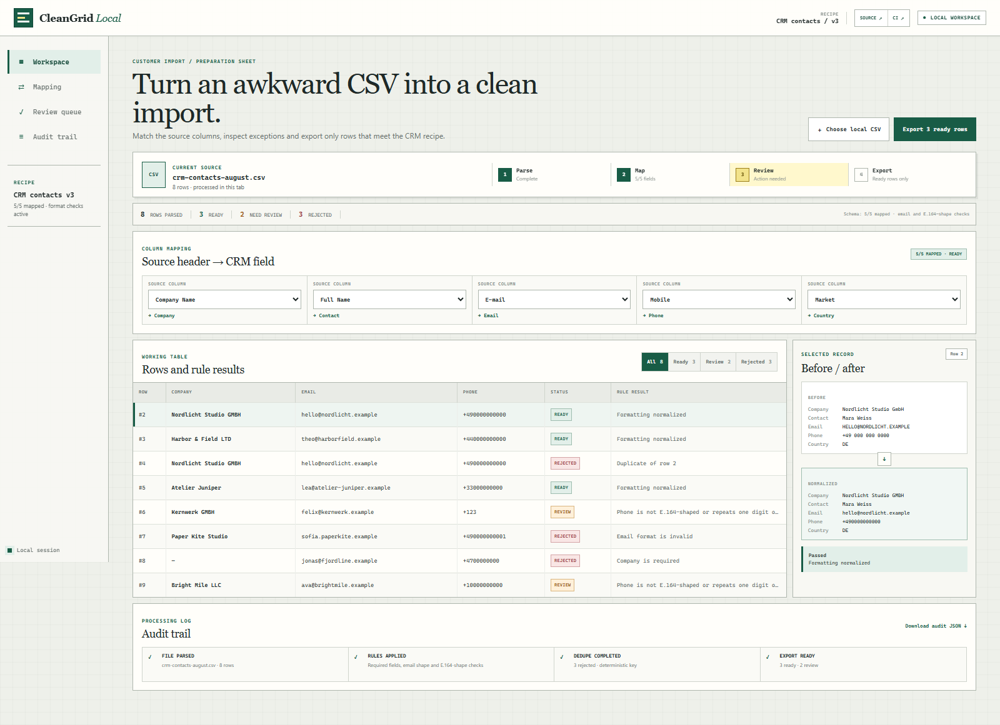
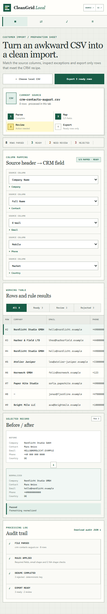

# CleanGrid

CleanGrid is a browser-local workspace for the awkward step before a CRM import: deciding which CSV rows are safe to export and which need a person to review.



## The problem

A file can look tidy in a spreadsheet and still fail an import. Column names vary, phone formats drift between countries, duplicate contacts hide behind casing differences, and incomplete records need explicit reasons instead of silent guesses.

CleanGrid keeps that preparation step visible. It parses one CSV in the current browser tab, suggests a small deterministic mapping, normalizes values, and separates the result into **Ready**, **Review**, and **Rejected** queues.

## Workflow

1. Choose a local comma-delimited CSV.
2. Confirm or adjust the suggested field mapping.
3. Inspect normalized values and rule reasons row by row.
4. Export only records that passed every blocking rule.
5. Download a local audit summary when the decision trail is needed.

No file is uploaded and the app makes no network request. The current rules cover required company and email fields, email shape, DE/GB/US phone normalization, an E.164-shaped phone check, and duplicate detection after normalization. “E.164-shaped” is deliberately narrow: it checks `+`, a non-zero first digit, and 8–15 digits after normalization. A separate placeholder rule holds a source value when, after punctuation is removed, it contains at least eight copies of one digit and no other digit. Neither rule claims that a number is assigned or reachable.

## Evidence, not just screenshots

The committed scenario starts with [`messy-customer-import.csv`](evidence/input/messy-customer-import.csv) and produces a repeatable result: **8 rows → 3 ready, 2 review, 3 rejected**. The second review row is intentional: the US-style all-zero source value matches the exact single-repeated-digit rule, remains visible in the queue, and is excluded from the ready export.

- [`ready.csv`](evidence/expected/ready.csv) is the exact clean export.
- [`review-and-rejected.json`](evidence/expected/review-and-rejected.json) records every held row and its reason.
- [`tests/domain.test.mjs`](tests/domain.test.mjs) covers parsing, mapping, phone-shape checks, classification, deduplication, CSV escaping and audit generation.
- [`tests/browser/workspace.spec.mjs`](tests/browser/workspace.spec.mjs) changes both required mappings in a real Chromium session, verifies the pending audit JSON, restores the mappings, inspects the ready CSV, checks all five mapping names, verifies the Source/CI links, and checks the 390 px layout for page overflow.
- [`scripts/verify-evidence.mjs`](scripts/verify-evidence.mjs) runs the fixture through the same domain functions used by the interface and fails if either expected output drifts.

The [three-minute walkthrough](docs/walkthrough.md) follows the duplicate, review and rejection cases. [Implementation notes](docs/implementation-notes.md) explain the rules and deliberate limits.

<details>
<summary>Mobile layout</summary>



</details>

## Run locally

Node.js 24 or newer is recommended. Install the locked test dependency, then start the dependency-free static app:

```bash
npm ci
npx playwright install chromium
npm start
```

The command starts a small static server on port `4173`. Open that port in a browser, or enable GitHub Pages from the repository root to use the same `index.html` as a hosted demo.

## Verify

```bash
npm test
npm run check
npm run verify:evidence
npm run verify
```

`npm run verify` is the complete local gate: syntax checks, 14 domain tests, fixture evidence, and three Chromium regressions. GitHub Actions installs the pinned dependency and browser, then runs that same gate on pushes and pull requests.

## Project boundary

This is a self-initiated portfolio project. Its contact records, company names and result counts are synthetic and exist only to make the workflow reproducible; they do not represent a paid client engagement or a production CRM migration.

The current build intentionally handles one comma-delimited file in memory. It does not write to a CRM, persist browser sessions, infer missing values, or provide production authentication, retention controls and connector-specific idempotency.

Source rights are reserved. See [PORTFOLIO-REVIEW-LICENSE.md](PORTFOLIO-REVIEW-LICENSE.md).

See [CHANGELOG.md](CHANGELOG.md) for the defects found after the first portfolio review and the exact corrections.
